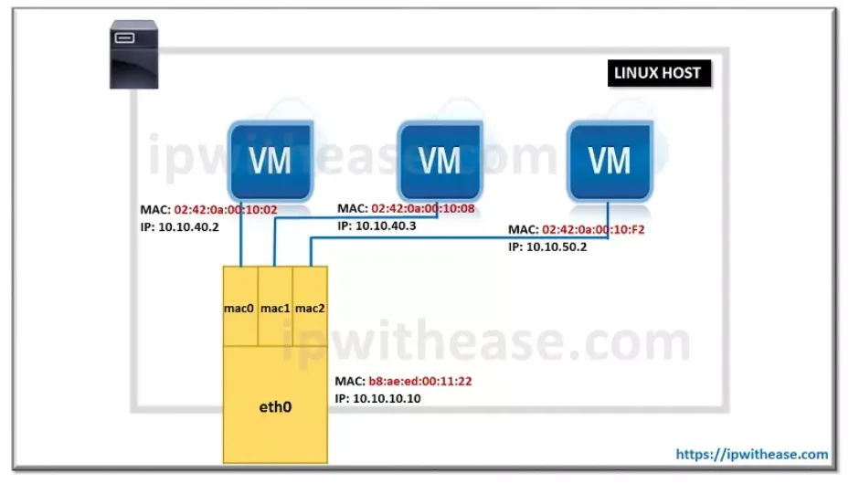
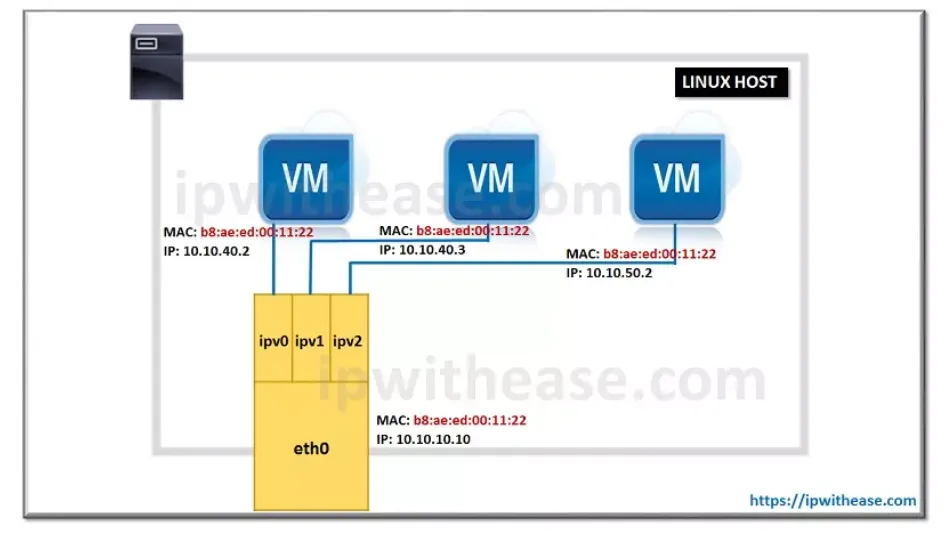

# CLI DOCKER Cheat Sheet

Docker provides the ability to package and run an application in a loosely isolated environment called a container. The isolation and security allows you to run many containers simultaneously on a given host. Containers are lightweight and contain everything needed to run the application, so you do not need to rely on what is currently installed on the host. You can easily share containers while you work, and be sure that everyone you share with gets the same container that works in the same way.  

## INSTALLATION

**Docker Desktop is available for Mac, Linux and Windows**  
<https://docs.docker.com/desktop>  

**View example projects that use Docker**  
<https://github.com/docker/awesome-compose>  

**Check out our docs for information on using Docker**  
<https://docs.docker.com>  

## IMAGES

Docker images are a lightweight, standalone, executable package
of software that includes everything needed to run an application:
code, runtime, system tools, system libraries and settings.  

**Build an Image from a Dockerfile**  
docker build -t <image_name>  

**Build an Image from a Dockerfile without the cache**  
docker build -t <image_name> . –no-cache  

**List local images**  
docker images  

**Delete an Image**  
docker rmi <image_name>  

**Remove all unused images**  
docker image prune  

## DOCKER HUB

Docker Hub is a service provided by Docker for finding and sharing
container images with your team. Learn more and find images at <https://hub.docker.com>  

**Login into Docker**  
docker login -u "username"  

**Publish an image to Docker Hub**  
docker push "username"/<image_name>  

**Search Hub for an image**  
docker search <image_name>  

**Pull an image from a Docker Hub**  
docker pull <image_name>  

## GENERAL COMMANDS

**Start the docker daemon**  
docker -d  

**Get help with Docker. Can also use –help on all subcommands**  
docker --help  

**Display system-wide information**  
docker info  

## CONTAINERS

A container is a runtime instance of a docker image. A container
will always run the same, regardless of the infrastructure.
Containers isolate software from its environment and ensure
that it works uniformly despite differences for instance between
development and staging.  

**Create and run a container from an image, with a custom name:**  
docker run --name <container_name> <image_name>  

**Run a container with and publish a container’s port(s) to the host.**  
docker run -p <host_port>:<container_port> <image_name>  

**Run a container in the background**  
docker run -d <image_name>  

**Start or stop an existing container:**  
docker start|stop <container_name> (or container-id)  

**Remove a stopped container:**  
docker rm <container_name>  

**Open a shell inside a running container:**
docker exec -it <container_name> sh

**Fetch and follow the logs of a container:**  
docker logs -f <container_name>  

**To inspect a running container:**  
docker inspect <container_name> (or container_id)  

**To list currently running containers:**  
docker ps

**List all docker containers (running and stopped):**  
docker ps --all / -a  

**View resource usage stats**  
docker container stats  

## [NETWORK INTERFACES](https://docs.docker.com/engine/network/)

Docker provides several types of network interfaces for connecting containers to each other or to other network resources. Here are the 7 types, along with a brief explanation and the command to create each:

1. **Default Bridge**: The default network driver when you start a container. It allows containers on the same host to communicate with each other. This network is isolated from the rest of the local network.
2. **Custom Bridge**: User-defined bridges provide better isolation & provide automatic DNS resolution between containers. Containers can be attached and detached from user-defined networks on the fly.
3. **Host** : Remove network isolation between the container and the Docker host. The container shares the network interface of the host, meaning it doesn’t have its own network space but uses the host’s directly.
4. **MacVlan** : Assigns a unique MAC address to each container, making them appear as separate physical devices on the network. Containers can communicate directly with the host’s physical network.  
  
5. **IPvlan**: Similar to macvlan, but containers share the MAC address of the host's main network interface. This can simplify network configuration.
Ipvlan supports L2 and L3 mode. In ipvlan l2 mode, each endpoint gets the same mac address but different ip address. In ipvlan l3 mode, packets are routed between endpoints, so this gives better scalability. So a single mac address of host can have 20 different IP ,one for each device , it solves the Promiscuous issue -ie it wouldn’t allow multiple connections to a single port in a switch, which was a major drawback for MACVLAN network.
  
6. **None** : Disables networking for the container. Useful if you don’t want the container to have network access.  
7. **Overlay** : Connects containers across multiple Docker hosts, typically used in a Docker Swarm cluster. It allows containers on different hosts to communicate as if they were on the same local network.  

### MACVLAN mode vs IPVLAN

IPVLAN should be used in cases where some switches restrict the maximum number of mac address per physical port due to port security configuration.
MACVLAN needs to be used in cases where common DHCP server is used since DHCP server would need unique mac address which IPVLAN does not have.

**To list networking interfaces:**  
docker network ls  

**To create a custom bridge network**  
docker network create my-net  
docker network create -d bridge my-net  
*-d flag tells Docker to use the bridge driver for the new network. You could have left this flag off as bridge is the default value for this flag.* 

docker run -itd --rm --network=my-net  -p 8080:80  --name container-name nginx  
*-dit flags mean to start the container detached (in the background), interactive (with the ability to type into it), and with a TTY (so you can see the input and output)*
*--rm flags remove the container when stopped*
*-p flags host:container (only in bridged mode)*  

**To connect & disconnect a running container to an existing user-defined bridge**  
docker network connect my-net my-nginx  
docker network disconnect my-net my-nginx  

**To create a MacVlan network**  
docker network create -d macvlan \
--subnet X.X.X.X/X \  
--gateway X.X.X.X \  
-o parent=enps03 \  
--ip-range X.X.X.X/X \  (or define the ip  when creating the container with the flag --ip X.X.X.X)
"name of network"  

docker run -itd --rm --network=my-macvlan-net  (--ip X.X.X.X) --name container-name nginx

**To create a MacVlan network (802.1q trunk bridge mode )**  
docker network create -d macvlan \
--subnet X.X.X.X/X \  
--gateway X.X.X.X \  
-o parent=enps03.20 \  
--ip-range X.X.X.X/X \  (or define the ip  when creating the container with the flag --ip X.X.X.X)
"name of network"  
*The IEEE’s 802.1Q standard was developed to address the problem of how to break large networks into smaller parts so broadcast and multicast traffic wouldn’t grab more bandwidth than necessary. The same concept is used in the docker network so that it can be controlled at a much smaller level.If you specify a parent interface name with a dot included, such as eenps03.20, Docker interprets that as a sub-interface of eth0 and creates the sub-interface automatically*  

**To create a IpVlan L2 network**  
docker network create -d ipvlan \  
--subnet X.X.X.X/X \  
--gateway X.X.X.X \
-o parent=enp0s3 \  
"name of network"  

**To create a IpVlan L3 network**  
docker network create -d ipvlan \  
--subnet X.X.X.X/X \  
--gateway X.X.X.X \
-o parent=enp0s3 -o ipvlan_mode=l3\  
"name of network"  

**To create a Host network**  
docker run -itd --rm --network=host --name container-name  

**To remove a network interface**  
docker network rm my-net  
